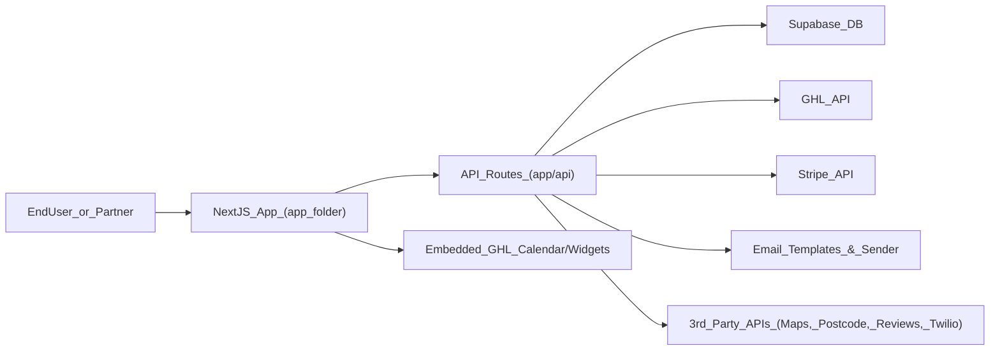

## nu-home Project Handover

This document gives a new developer enough context to understand what `nu-home` does, how to run it, and where to find/modify the most important functionality.

---

## 1. What this project is

- **Purpose**: A Next.js + Supabase app for home-services quotes and surveys, with a partner/admin portal, automated emails, GHL (GoHighLevel) CRM integration, payments (Stripe, Kanda), and supporting flows like roof mapping.
- **Key personas**:
  - **End customer**: Visits quote/survey/enquiry flows (e.g. boiler, solar, services), submits details, may pay/defer payment.
  - **Partner**: Manages their products, branding, notification settings, calendars, and views leads.
  - **Admin**: Manages service categories, form questions, products, field mappings, and partner onboarding.

For deeper feature docs, also see:
- `ROOF_MAPPING_SETUP.md` – Google Maps roof drawing feature.
- `TEMPLATE_PROCESSING_EXAMPLES.md` – field-mapping template/Handlebars examples.
- `components/shared/GHL_CALENDAR_README.md` – reusable GHL calendar components.
- `/docs` route (served by `app/docs/page.tsx`) – in-app documentation and walkthroughs.

---

## 2. Tech stack overview

- **Framework**: Next.js (App Router) in `app/`.
- **Styling**: Tailwind CSS (`tailwind.config.ts`, `app/globals.css`) + shadcn/ui-style components under `components/ui/`.
- **Database & auth**: Supabase (`lib/supabase/client.ts`, `utils/supabase/*`, `supabase/migrations/*`).
- **Backend/API**: Next.js Route Handlers under `app/api/*`.
- **Integrations**:
  - **Email**: Custom templates in `lib/email-templates/*`, sent via multiple `app/api/email/*` routes.
  - **GHL (GoHighLevel)**: `lib/ghl-api.ts`, `lib/ghl-api-client.ts`, `app/api/ghl/*`.
  - **Payments**: Stripe (`app/api/stripe/create-payment-intent/route.ts`, `components/category-commons/checkout/*`), Kanda (`app/api/kanda/*`, `components/FinanceCalculator.tsx`).
  - **Chatbot / AI**: Gemini / OpenAI style field-mapping AI (`app/api/chatbot/*`, `app/api/field-mapping-ai/route.ts`, `lib/gemini-service.ts`).
  - **Places / postcode**: `app/api/postcode-lookup/route.ts`, `app/api/places/*`, `public/postcode.js`.
  - **Google reviews**: `app/api/google-reviews/route.ts`.
- **Misc**:
  - Roof mapping flow: `components/category-commons/quote/RoofMappingStep.tsx`, `app/api/roof-mapping/upload/route.ts`, `ROOF_MAPPING_SETUP.md`.
  - Field-mapping engine: `lib/field-mapping-engine.ts`, `TEMPLATE_PROCESSING_EXAMPLES.md`.

---

## 3. Getting started (local dev)

- **Requirements**:
  - Node.js 18+ recommended (Next.js latest & React 19).
  - npm (repo uses `package-lock.json`).
  - Supabase project (see below) and necessary third-party API keys (GHL, Stripe, Twilio, etc.).

- **Install dependencies**:
  - From repo root:
    - `npm install`

- **Run dev server**:
  - `npm run dev`
  - Default dev URL: `http://localhost:3000`.

- **Build & production**:
  - Build: `npm run build`
  - Start production server: `npm start`

The starter `README.md` is the original Next.js + Supabase example and is mostly superseded by this `HANDOVER.md`.

---

## 4. Configuration & environment variables

Environment variables are consumed across `lib/`, `utils/supabase/`, and `app/api/*`. Below is a **non-secret overview** of what you need to configure.

### 4.1 Supabase

Used in `lib/supabase/client.ts` and `utils/supabase/*`:
- **`NEXT_PUBLIC_SUPABASE_URL`** – Supabase project URL.
- **`NEXT_PUBLIC_SUPABASE_ANON_KEY`** – public anon key.

For server-side scripts and older pieces (`public/postcode.js`) you may also see:
- **`SUPABASE_URL`**, **`SUPABASE_SERVICE_ROLE_KEY`** – service role credentials (do **not** expose to client).

### 4.2 Domains & base URLs

- **`NEXT_PUBLIC_SITE_URL`** – main marketing/host domain used in places like `components/partner/IntegrationComponent.tsx`, middleware, and partner URL generation.
- **`NEXT_PUBLIC_APP_URL`** – base URL for auth redirects and GHL OAuth callback URLs (`app/auth/crm/callback/route.ts`, `app/api/ghl/auth-url/route.ts`).
- **`NEXT_PUBLIC_BASE_DOMAIN`** – base domain used for building partner subdomain quote links in `lib/email-templates.ts` (e.g. `subdomain.${NEXT_PUBLIC_BASE_DOMAIN}`).

### 4.3 GHL (GoHighLevel)

From `lib/ghl-api.ts`, `app/api/ghl/*`, and GHL calendar components:
- **`GHL_CLIENT_ID`**, **`GHL_CLIENT_SECRET`**, **`GHL_SHARED_SECRET`** – OAuth client credentials and shared secret.

The app stores tokens and configuration in Supabase tables via `lib/ghl-api.ts` and uses them from:
- `app/api/ghl/integration/route.ts`
- `app/api/ghl/pipelines`, `custom-fields`, `tags`, `calendar-slots`, `appointments`.

### 4.4 Payments & finance

- **Stripe** (`components/category-commons/checkout/CheckoutLayout.tsx`, `app/api/stripe/create-payment-intent/route.ts`):
  - **`NEXT_PUBLIC_STRIPE_PUBLISHABLE_KEY`** – client-side Stripe.
  - **`STRIPE_SECRET_KEY`** (not shown directly but required by Stripe server route) – server secret key.
- **Kanda** (`app/api/kanda/*`, `components/FinanceCalculator.tsx`):
  - Kanda-specific API keys/IDs (refer to those files; exact names depend on your current env configuration).

### 4.5 Messaging & verification

From `app/api/otp/send/route.ts` and `app/api/otp/verify/route.ts`:
- **`TWILIO_ACCOUNT_SID`**, **`TWILIO_AUTH_TOKEN`**, **`TWILIO_VERIFY_SID`** – SMS/OTP provider credentials.

### 4.6 AI / chatbot / field-mapping AI

- **`GOOGLE_AI_API_KEY`** – Gemini API key (`app/api/chatbot/*`, `app/api/chatbot/config/route.ts`).
- **`NEXT_PUBLIC_OPENAI_API_KEY`** – client-side accessible key used in `app/api/field-mapping-ai/route.ts` (typically you will proxy via backend instead of exposing this in production).

### 4.7 Google Maps, postcode & places

- **`NEXT_PUBLIC_GOOGLE_MAPS_API_KEY`** – roof mapping and map display (`components/category-commons/quote/RoofMappingStep.tsx`, `ROOF_MAPPING_SETUP.md`).
- **`WEBUILD_API_KEY`** / **`NEXT_PUBLIC_WEBUILD_API_KEY`** – property/postcode lookup (`app/api/postcode-lookup/route.ts`, `app/api/places/*`, `components/category-commons/quote/PostcodeStep.tsx`).

### 4.8 Reviews, scraping & utilities

- **`APIFY_TOKEN`** – Google reviews integration (`app/api/google-reviews/route.ts`).
- **`ENCRYPTION_KEY`** – symmetric key used in `lib/encryption.ts` for storing partner credentials/config securely.

### 4.9 Vercel / deployment

Used from `app/api/domain/add/route.ts`, `app/api/domain/verify/route.ts`, and `app/api/domain/debug/route.ts`:
- **`VERCEL_AUTH_TOKEN`** – token for Vercel API.
- **`VERCEL_PROJECT_ID`** – the Vercel project id whose domains are managed.

Additional deployment-related variables may be used in example docs (`components/tutorial/*`) but are mostly for the starter template.

> **Tip**: A quick way to audit env usage is to search for `process.env` in the codebase when adding new configuration.

---

## 5. Architecture overview

### 5.1 High-level system diagram

### 5.2 Frontend structure (App Router)

Key directories under `app/`:
- **Auth**: `(auth-pages)` – `sign-in`, `sign-up`, `forgot-password`, plus auth callbacks in `app/auth/*`.
- **Docs**: `app/docs/page.tsx` – in-app documentation site.
- **Boiler flows**: `app/boiler/*` – enquiry, quote, survey, checkout/success.
- **Solar flows**: `app/solar/*` – similar flows tailored for solar.
- **Generic services**: `app/services/*` – category-based quote flows (dynamic `[slug]`).
- **Partner portal**: `app/partner/*` – dashboard, leads, settings, notifications, my-products, addons, import, highlights/key-points, etc.
- **Admin area**: `app/admin/*` – dashboard, service-categories, products, form-questions, field-mappings, addons, partners.
- **API routes**: `app/api/*` – backend endpoints (emails, GHL, Stripe, Kanda, postcode, roof-mapping, places, chatbot, etc.).

Shared UI & domain components are under `components/`:
- `components/category-commons/*` – layouts and building blocks reused across boiler/solar/services flows.
- `components/partner/*` – partner dashboard widgets, forms, and notifications UI.
- `components/admin/*` – admin management UIs for questions, fields, categories, products.
- `components/shared/*` – GHL calendar, generic product forms, search, etc.
- `components/ui/*` – low-level UI primitives.

The global layout is defined in `app/layout.tsx` and fetches the current user and profile to influence the shell.

### 5.3 Backend/API & business logic

- **Route handlers**:
  - `app/api/email/*` – email sending for different verticals (boiler vs solar) and events (enquiry submitted, survey submitted, quote initial/verified, save-quote, callback-requested, checkout, etc.).
  - `app/api/ghl/*` – integration endpoints for GHL auth, pipelines, tags, custom fields, calendar slots, appointments, debug routes.
  - `app/api/stripe/*` – payment intents.
  - `app/api/kanda/*` – finance request generation.
  - `app/api/postcode-lookup`, `app/api/places/*` – property lookup and address suggestions.
  - `app/api/roof-mapping/upload` – image upload for roof drawings.
  - `app/api/field-mapping-ai`, `app/api/chatbot/*` – AI-powered mapping and chatbot.
- **Lib layer (`lib/`)**:
  - `lib/products.ts`, `lib/products-actions.ts` – product queries and actions.
  - `lib/partner.ts`, `lib/partner-settings.ts`, `lib/partner-settings-client.ts` – partner data, settings, and client helpers.
  - `lib/email-templates/*` – default email template builders + solar variants.
  - `lib/email-templates.ts` – processing of partner-specific templates and quote links.
  - `lib/field-mapping-engine.ts` – advanced template processing for field mappings.
  - `lib/ghl-api.ts`, `lib/ghl-api-client.ts`, `lib/ghl-appointments.ts`, `lib/ghl-contact-helper.ts` – all GHL logic.
  - `lib/encryption.ts` – encryption helper for secrets in DB.
  - `lib/gemini-service.ts`, `lib/gtm.ts`, `lib/image-upload.ts`, `lib/product-image-upload.ts` – supporting services.

### 5.4 Data model & migrations

- **Supabase migrations**: `supabase/migrations/*.sql`.
  - Email templates setup, partner settings, lead submission data, payment & address fields, GHL integration tables, default field mappings, content sections, survey/completion flags, product image storage buckets, calendar settings, GTM event names, bundles, tags, etc.
- **Additional SQL scripts**: `sql/*.sql` and `run_migration.sql` for targeted schema adjustments (e.g., adding JSONB columns to `partner_leads`).
- Key tables implied by migrations and usage:
  - `UserProfiles`, `UserCategoryAccess`, `ServiceCategories`, `Products`, `PartnerProducts`, `partner_leads`, `lead_submission_data`, `email_templates`, `ghl_integrations`, `partner_settings`, plus various mapping tables for custom fields and default mappings.

---

## 6. Key domains & end-to-end flows

### 6.1 Partner portal

- **Entry points**: `app/partner/page.tsx` (dashboard), plus sub-routes like `leads`, `my-products`, `addons`, `settings`, `notifications`, `highlights`, `key-points`, `configuration`, `import`.
- **Data access**: Uses server-side Supabase client (`createClient` from `utils/supabase/server.ts`) to query:
  - `UserProfiles` (profile & status), `UserCategoryAccess` (approved/pending categories), `PartnerProducts` (product counts), `partner_leads` (lead lists and counts).
- **What partners can do**:
  - View dashboard metrics and recent leads.
  - Manage own products (`app/partner/my-products/*`, `components/partner/PartnerProductForm.tsx`).
  - Configure branding, integrations (GHL, Stripe, etc.), calendars, notifications, and domain settings (`app/partner/settings/page.tsx`, `components/partner/IntegrationComponent.tsx`, `CustomDomainComponent.tsx`, `BrandingComponent.tsx`).
  - Review and filter leads (`app/partner/leads/*`, `components/partner/LeadCard.tsx`, `LeadFilters.tsx`).

### 6.2 Admin area

- **Entry**: `app/admin/page.tsx` – shows counts for questions, service categories, partners, products and recent records.
- **Management sections**:
  - **Service categories**: `app/admin/service-categories/*`, UI in `components/admin/ServiceCategoryTabs.tsx`, `EditCategoryForm.tsx`, `NewCategoryForm.tsx`.
  - **Form questions**: `app/admin/form-questions/*`, UIs in `components/admin/FieldForm.tsx`, `QuestionForm.tsx`, `SimpleFormQuestionsEditor.jsx`, `FormFlowEditor.jsx`.
  - **Field mappings**: `app/admin/field-mappings/page.tsx`, `lib/field-mapping-engine.ts`, `TEMPLATE_PROCESSING_EXAMPLES.md`.
  - **Products & addons**: `app/admin/products/*`, `app/admin/addons/*` + `components/admin/ProductForm.tsx`, `AdminProductsTable.tsx`, `AdminAddonsTable.tsx`.
- Admin is the source of truth for how questions, categories, and field mappings drive the quote/enquiry flows.

### 6.3 Customer quote / enquiry / survey flows

These flows share many components in `components/category-commons/*`.

- **Boiler quote**: `app/boiler/quote/page.tsx`.
  - Uses steps like `PostcodeStep`, `UserInfoForm`, `QuoteFormSteps`.
  - Resolves partner from host (`resolvePartnerByHost` in `lib/partner.ts`), loads category questions from Supabase, and saves responses into `lead_submission_data`.
  - Integrates OTP for verification (`app/api/otp/*`) and tracks verification state in `lead_submission_data`.
  - Triggers GTM events via `lib/gtm.ts`.
- **Boiler enquiry**: `app/boiler/enquiry/page.tsx`.
  - Uses `EnquiryLayout`, `ImageUploadArea`, and additional boiler-specific fields.
  - Captures multiple photos and context, then upserts into `lead_submission_data` with rich `device_info` and `session_id`.
- **Surveys**: `app/boiler/survey/page.tsx`, `app/solar/survey/page.tsx`, generic `components/category-commons/survey/SurveyLayout.tsx`.
  - Optionally integrates GHL calendar to book survey appointments.
- **Roof mapping step**: `components/category-commons/quote/RoofMappingStep.tsx`.
  - Uses Google Maps to let users draw their roof, capture a screenshot via `html2canvas`, then upload via `app/api/roof-mapping/upload/route.ts` into Supabase storage.
  - Detailed setup in `ROOF_MAPPING_SETUP.md`.

Internally, these flows:
- Read configuration and questions from Supabase tables (`FormQuestions`, `ServiceCategories`, `partner_settings`, etc.).
- Write structured progress into `lead_submission_data` (including `pages_completed`, `quote_data`, `conversion_events`).
- Use shared components for layout, loaders, headers, OTP, postcode lookup, and quote steps.

### 6.4 Email templates & notifications

- **Templates**:
  - Defaults in `lib/email-templates/*` (boiler & solar variants).
  - Per-partner overrides and processing in `lib/email-templates.ts` and `lib/email-notification-settings.ts`.
- **Sending emails**:
  - Triggered from `app/api/email/*` route handlers (boiler and solar subtrees).
  - Each handler:
    - Pulls partner/email template settings from Supabase.
    - Builds context (customer details, quote/enquiry/survey info, links).
    - Renders HTML/text using templates and/or field-mapping engine.
    - Sends via configured provider (e.g. `nodemailer`).
- **Partner configuration UI**:
  - `app/partner/notifications/page.tsx` – main notifications page.
  - `components/partner/notifications/*` – `EmailNotificationSettings.tsx`, `EmailTemplateEditor.tsx`, `LeadsMapping.tsx` to let partners toggle which emails go to whom and customize content.

When adding new notifications, follow existing patterns in `lib/email-templates/*` and map them to new `app/api/email/...` routes.

### 6.5 GHL integration (CRM & calendar)

- **OAuth & token storage**:
  - Handled by `lib/ghl-api.ts` + `app/api/ghl/auth-url/route.ts` and `app/auth/crm/callback/route.ts`.
  - Token data is persisted in Supabase `ghl_integrations` via `saveGHLIntegration`.
- **Operational APIs**:
  - `app/api/ghl/custom-fields`, `tags`, `pipelines`, `opportunities` – reading CRM structure and data.
  - `app/api/ghl/calendar-slots`, `appointments` – scheduling.
- **Calendar UI**:
  - `hooks/use-ghl-calendar.ts`, `components/shared/GHLCalendar.tsx`, `GHLTimeSlots.tsx`.
  - Detailed usage in `components/shared/GHL_CALENDAR_README.md`.
- **Lead and opportunity creation**:
  - `lib/ghl-appointments.ts` and `lib/ghl-contact-helper.ts` coordinate contact + opportunity creation from lead data.

---

## 7. Database & migrations

- **Location**: `supabase/migrations/*.sql` and manually runnable SQL scripts in `sql/` and `run_migration.sql`.
- **What they cover**:
  - Core tables for partners, products, categories, questions.
  - Email templates and per-partner email settings.
  - Lead tracking: `partner_leads`, `lead_submission_data`, address/payment fields, product/addon/bundle JSONB columns.
  - GHL integration tables, calendar settings, GTM event names.
  - Buckets and storage tables for product images and roof mapping.
- **How to apply**:
  - Typically run via `supabase db push` or `supabase db reset` using these migrations; if you use the `run_migration.sql` script, execute it against your Supabase Postgres instance (e.g., via the SQL editor) to ensure helper columns exist.

When adding new tables or columns, follow the existing naming conventions and pattern of timestamped migration filenames.

---

## 8. Development workflow & conventions

- **Coding style**:
  - React function components, hooks (`hooks/`), TypeScript throughout.
  - Shared logic in `lib/` and `utils/` instead of burying business rules in components.
  - Shadcn-style UI components in `components/ui/*` reused everywhere.
- **Routing**:
  - App Router with nested layouts and dynamic routes like `[id]`, `[slug]`.
  - Auth-protected areas (`app/admin/*`, `app/partner/*`) rely on Supabase auth in `app/layout.tsx` and dedicated middleware (`middleware.ts`, `utils/supabase/middleware.ts`).
- **Data & forms**:
  - Forms typically use `react-hook-form` + Zod (where validation is needed) and write to Supabase tables.
  - Lead/quote/enquiry flows centralize their persisted state in `lead_submission_data`.
- **Feature toggles & partner-specific behavior**:
  - Implemented via `partner_settings` (see `lib/partner-settings.ts`) and `calendar_settings` / `email_notification_settings` columns; UI for these is mostly under `app/partner/settings` and `app/partner/notifications`.

---

## 9. Troubleshooting & debugging

- **Logs**:
  - `server.log` at root may capture server-side logs if enabled in your environment.
  - Many GHL and email functions log detailed traces to the console (see `lib/ghl-api.ts`, `lib/email-templates.ts`, and various `app/api/*` routes).
- **Debug routes**:
  - `app/api/domain/debug/route.ts` – inspect Vercel domain configuration.
  - `app/api/ghl/debug`, `app/api/ghl/debug-mappings`, `app/api/ghl/debug-opportunities` – introspect GHL integration state.
  - `app/api/email/test/route.ts` – send test email (if implemented).
- **Common failure modes**:
  - Missing or misconfigured env vars (Supabase, GHL, Stripe, Google Maps, APIFY, Twilio).
  - Partner has not configured domain or calendar settings yet (watch for `null`/`undefined` in `partner_settings`).
  - Email templates missing mandatory placeholders or not active in `email_templates` table.

If something is failing, start by:
- Checking `process.env`-related code for the relevant integration.
- Hitting the associated `/api/*` debug/test routes.
- Verifying the corresponding Supabase tables have expected records.

---

## 10. How to extend the project safely

When implementing new features:
- **Reuse existing patterns**:
  - Add new customer flows under `app/boiler`, `app/solar`, or `app/services` and reuse `components/category-commons/*`.
  - Add new partner/admin UIs under `app/partner/*` / `app/admin/*` and corresponding components in `components/partner/*` or `components/admin/*`.
- **Add migrations**:
  - Create new `.sql` files under `supabase/migrations` with timestamped names.
  - Keep `lead_submission_data` and `partner_leads` as the central place for tracking lead lifecycle.
- **Integrate with external services**:
  - Add new `app/api/*` routes and wrap external APIs in `lib/*` helper modules.
  - Store any long-lived tokens/keys encrypted or in dedicated Supabase tables.

Reading this file top-to-bottom plus skimming the linked docs (`ROOF_MAPPING_SETUP.md`, `TEMPLATE_PROCESSING_EXAMPLES.md`, `components/shared/GHL_CALENDAR_README.md`, the `/docs` route) should give a new developer a solid understanding of how to run and evolve `nu-home`."}}]} />